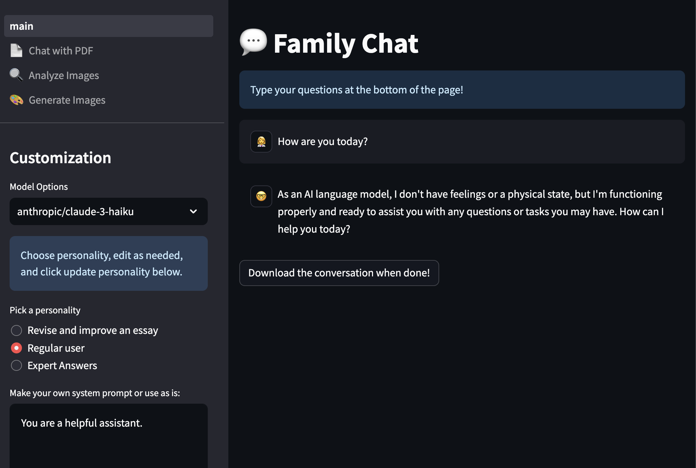
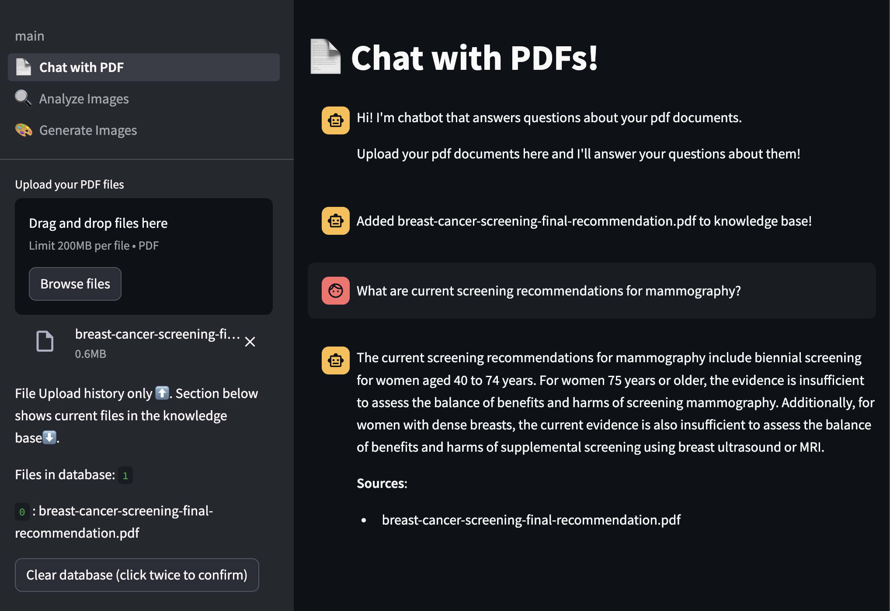

# API Powered AI Chatbot App for Shared Personal use

This application leverates cutting-edge AI technologies to offer a comprehensive suite of features, including a conversational chatbot with memory capabilities, a PDF chat feature for document-based interactions, image generation powered by OpenAI, and an advanced image analysis tool. 

## Features

### Chatbot with Memory Using OpenRouter

Utilizes the OpenRouter API (for a variety of models) to provide an intelligent chatbot experience, making conversations more coherent and engaging.



### PDF Chat Feature Using Embedchain

Leverages the Embedchain library to facilitate document-based or Internet site based chats. Users can upload PDF documents and/or perform web searchs and the chatbot can reference content within these documents and/or sites to provide relevant responses. And, citations include precise text used to answer the user's query!



### Image Generation with OpenAI

Integrates with OpenAI's API to generate images based on textual prompts provided by users. This feature harnesses the power of models like DALL-E to transform creative ideas into visual art.


### Image Analysis Tool

Employs advanced image recognition techniques to analyze uploaded images, giving insights or descriptions about the content of the image which can be particularly useful for educational or accessibility purposes.


## Getting Started - For General Use

To run this application locally, you'll need to have Python and Pip installed on your system. Follow the steps below to set up the environment and start the application:

1. Clone the repository to your local machine:

```bash
git clone https://github.com/drdavidl/family-chat/blob/main/main.py
```

2. Navigate to the project directory:

```bash
cd path-to-your-project
```

3. Install the required dependencies:

```bash
pip install -r requirements.txt
```

4. Obtain API keys and update your secrets file.

Be sure to copy the secrets.example file into a secrets.toml file (within the .streamlit directory) that is **NOT** tracked by git. This file should contain your API keys and a password so only shared users can access it. (Individual user accounts are coming if/when I have time...). You'll need to set the API keys from OpenAI and OpenRouter in your secrets.toml file. Obtain keys at openai.com and openrouter.ai. A small limited credit on these API services goes a long way!

5. Start the Streamlit application for use on your local computer:

```bash
streamlit run main.py
```

6. Finally, create a personal account with Streamlit.io and link your Github account to post your app to the cloud. You can then share the app link with your family for personal use. Update passwords and API keys in the settings on the Streamlit server.

## Usage

Follow the on-screen instructions for each feature within the Streamlit application. Here's a brief overview:

- **Chatbot with Memory**: Engage with the chatbot through the chat interface. The chatbot will remember context from your conversation for a seamless experience.
- **PDF Chat Feature**: Upload PDF documents through the provided interface. You can then ask the chatbot questions related to the content of the uploaded documents.
- **Image Generation**: Enter a textual prompt describing the image you wish to generate, and the application will use AI to create an image based on your description.
- **Image Analysis**: Upload an image to have it analyzed by our AI tool. The application will provide information or an interpretation of the image's content.
- **Post to Streamlit Cloud**: Share your running app with your family.

## For Contributors

If you're considering contributing to the project, please start by forking the repository. This will create your own copy of the project under your account, where you can make changes without affecting the original codebase.

After forking, you can clone your forked repository to your local environment using:

```bash
git clone https://your-forked-repository-url.git
```

From there, you can create a new branch for your changes, commit those changes, and push them back to your forked repository. When you're ready, submit a pull request to propose integrating your changes into the original project.

## Acknowledgments

- Chatbot feature powered by [OpenRouter API](https://openrouter.ai).
- Image generation built with technologies from [OpenAI](https://openai.com).
- Image analysis utilizes advanced computer vision models, also from OpenAI.
- Streamlit hosting at [Streamlit.io](https://streamlit.io).

## References

We make use of the Embedchain framework in this project:

- Taranjeet Singh, Deshraj Yadav. Embedchain: The Open Source RAG Framework. 2023, GitHub. Available at: [https://github.com/embedchain/embedchain](https://github.com/embedchain/embedchain).

<a href="https://www.buymeacoffee.com/dlteach" target="_blank"></a>


